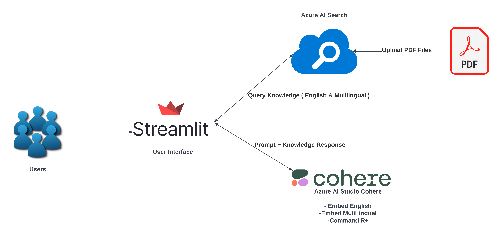
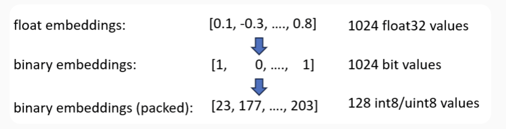
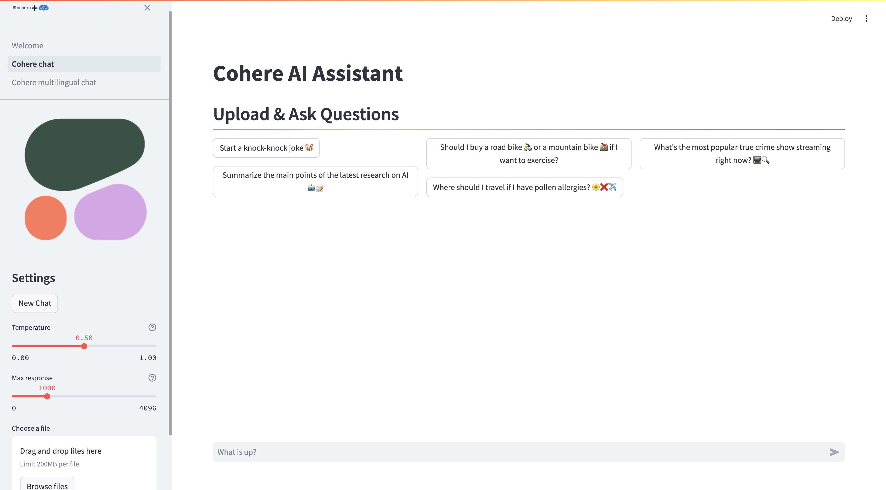

# Cohere & Azure AI Search RAG Demo  


   
Welcome to the Cohere & Azure AI Search Retrieval-Augmented Generation (RAG) demo! This project showcases how to leverage Cohere Embed V3 for generating int8 and binary embeddings, significantly reducing memory costs while maintaining high search quality. These embeddings are integrated with Azure AI Search to perform RAG using CommandR+ in Azure AI Studio.  
   
## Table of Contents
- [Introduction](#introduction)  
- [Features](#features)  
- [Setup](#setup)  
- [Usage](#usage)  
- [Contributing](#contributing)  
- [License](#license)  
   
## Introduction  
   
Semantic search over large datasets can require a lot of memory, which is expensive to host in a vector database. For example, searching across all of Wikipedia’s data requires storing 250 million embeddings. With 1024 dimensions per embedding and each dimension as float32 with 4 bytes, you will need close to 1 TB of memory on a server.  


   


   
## Features  
   
- **Memory Optimization**: Use int8 and binary embeddings to reduce memory usage by up to 32x.  
- **High Search Quality**: Maintain 90-99.99% of the original search quality.  
- **Multi-Language Support**: Supports multiple languages for diverse applications.  
- **Integration with Azure AI Search**: Seamlessly integrate with Azure AI Search for advanced RAG capabilities.  
- **Compression-Friendly Embedding Model Training**: Ensures superior search quality even with vector space compression.

  
   
## Setup  
   
### Prerequisites  
   
- Python 3.9 or higher  
- Streamlit  
- Cohere API Key
- Cohere Command R+
- Cohere English Embedding Model
- Cohere Multilingual Embedding Model
- Azure AI Search API Key  
- Azure AI Studio  
   
### Installation  
   
1. Clone the repository:  
    ```bash  
    git clone https://github.com/vrajroutu/cohere-azure-ai-search-rag.git  
    cd cohere-azure-ai-search-rag  
    ```  
   
2. Install the required packages:  
    ```bash  
    pip install -r requirements.txt  
    ```  
   
3. Set up environment variables:  
    Create a `.env` file in the root directory and add your API keys and endpoints:  
    ```env  
    AZURE_AI_STUDIO_COHERE_EMBED_KEY=your_cohere_embed_key  
    AZURE_AI_STUDIO_COHERE_EMBED_ENDPOINT=your_cohere_embed_endpoint  
    AZURE_AI_STUDIO_COHERE_MULTIEMBED_KEY=your_cohere_multilingual_embed_key  
    AZURE_AI_STUDIO_COHERE_MULTIEMBED_ENDPOINT=your_cohere_multilingual_embed_endpoint  
    AZURE_AI_STUDIO_COHERE_COMMAND_KEY=your_cohere_command_key  
    AZURE_AI_STUDIO_COHERE_COMMAND_ENDPOINT=your_cohere_command_endpoint  
    SEARCH_SERVICE_API_KEY=your_search_service_api_key  
    SEARCH_SERVICE_ENDPOINT=your_search_service_endpoint  
    BINARY_INDEX_NAME=your_binary_index_name  
    INT8_INDEX_NAME=your_int8_index_name  
    MULTIBINARY_INDEX_NAME=your_multilingual_binary_index_name  
    MULTIINT8_INDEX_NAME=your_multilingual_int8_index_name  
    ```  
   
## Usage  
   
### Running the Application  
   
1. Start the Streamlit application:  
    ```bash  
    streamlit run welcome.py  
    ```  
   
2. Open your browser and navigate to `http://localhost:8501`.  


### Uploading Files and Asking Questions  
   
- **Upload Files**: Use the sidebar to upload PDF files. The .pdf from these files will be extracted and indexed.  
- **Ask Questions**: Type your questions in the chat input at the bottom center of the page. The system will perform a vector search using the uploaded documents and provide responses.  
   
### Example Questions  
   
- "Start a knock-knock joke 🤡"  
- "Should I buy a road bike 🚴‍♂️ or a mountain bike 🚵‍♀️ if I want to exercise?"  
- "What's the most popular true crime show streaming right now? 📺🔍"  
- "Summarize the main points of the latest research on AI 🤖📝"  
- "Where should I travel if I have pollen allergies? 🌼❌✈️"  
   
## Contributing  
   
We welcome contributions to enhance the functionality and features of this project. Please follow these steps to contribute:  
   
1. Fork the repository.  
2. Create a new branch:  
    ```bash  
    git checkout -b feature/your-feature-name  
    ```  
3. Make your changes and commit them:  
    ```bash  
    git commit -m "Add your feature"  
    ```  
4. Push to the branch:  
    ```bash  
    git push origin feature/your-feature-name  
    ```  
5. Open a pull request.  
   
## License  
   
This project is licensed under the MIT License. See the [LICENSE](LICENSE) file for details.  
   
---  
   
For more information, read the full announcement from Cohere [here](https://cohere.com/blog/int8-binary-embeddings).  
   
---  
   
Feel free to reach out to us on [LinkedIn](https://www.linkedin.com/in/vrajkishoreroutu/) for any queries or support.  
   
--- 
